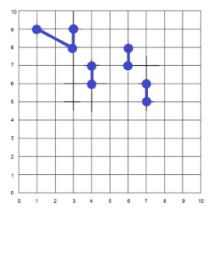
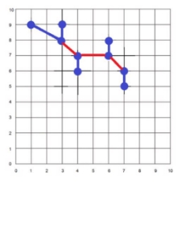

# ADS 
## Zadanie č. 4

Na obrázku vpravo sú znázornené mestá (modré uzly). Ak je medzi mestami natiahnutý komunikačný  kábel, ten je zakreslený ako modrá hrana medzi  týmito mestami. Z mesta A do mesta B je možné  komunikovať, ak existuje cesta po modrých hranách  z mesta A do mesta B.   

Vstupom pre Váš algoritmus  bude textový subor **graf.txt** (načíta sa zo vstupu),v ktorom na každom riadku budú informácie o x-ovej  a y-ovej (celé nezáporné čísla) súradnici vrcholov,  ktoré spája jedna (modrá) hrana. Pre obrázok vpravo  by súbor graf.txt vyzeral nasledovne:  

[1,9] [3,8]   

[3,8] [3,9]  

[4,6] [4,7]  

[6,7] [6,8]  

[7,5] [7,6]   

Poradie riadkov nie je dôležité, a taktiež nie je dôležité poradie bodov, ktoré spájajú jednotlivé hrany, t.j. [1,9] [3,9]  a [3,9] [1,9] označuje tú istú hranu. 

Vašou úlohou je napísať program (odporúčané sú jazyky C/C++, Java alebo Python), ktorý zistí, ktoré mestá  (vrcholy) treba spojiť, aby bolo možné komunikovať medzi  ľubovoľnými dvoma mestami, pričom dĺžka doplnených  hrán musí byť čo najmenšia.  

Na obrázku vpravo vidno ideálne riešenie zakreslené  červenými hranami.   

Program zapíše riešenie do súboru **out.txt**.  

Pre obrázok vpravo by ideálne riešenie v súbore out.txt  vyzeralo nasledovne (poradie riadkov nie je dôležité,  rovnako ani poradie bodov, ktoré hrana spája):  

[3,8] [4,7] [4,7] [6,7] [6,7] [7,6] 

Program musí dokázať pracovať aj s veľkými grafmi (stotisíce vrcholov a hrán). Pomôcka: union-find, closest-pair 

**Do vytvoreného miesta odovzdania odovzdajte: zdrojové súbory a súbor out.txt. Hodnotia sa len zadania odovzdané do AISu !!!** 
